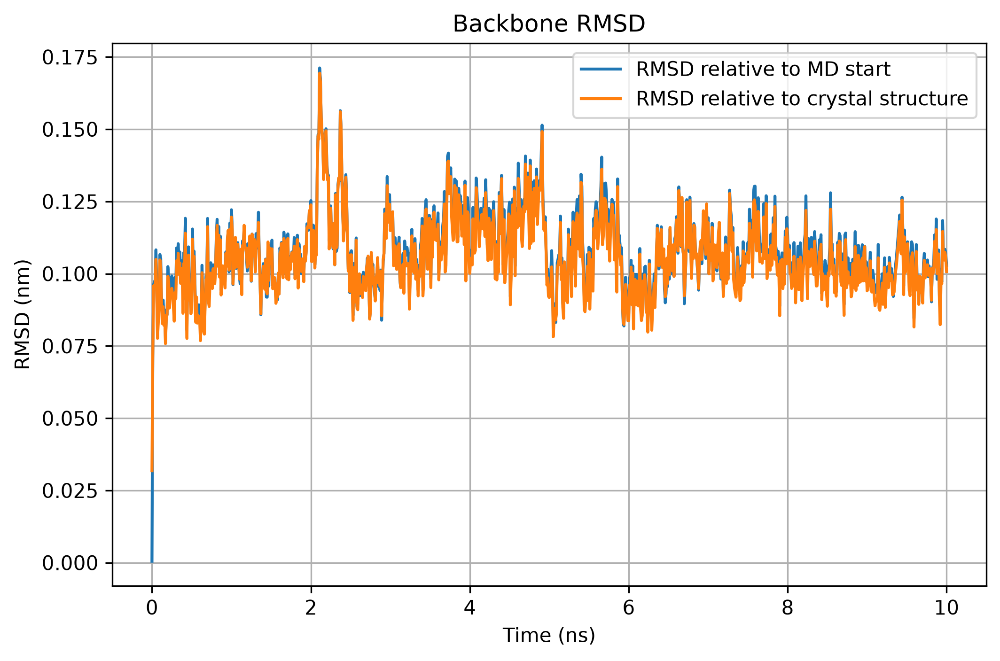
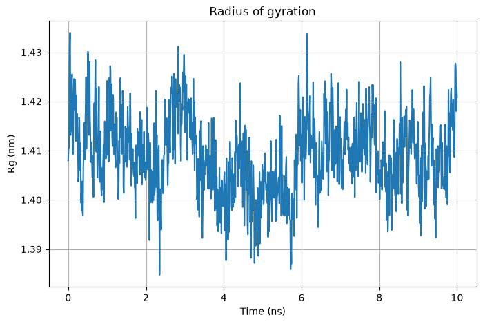
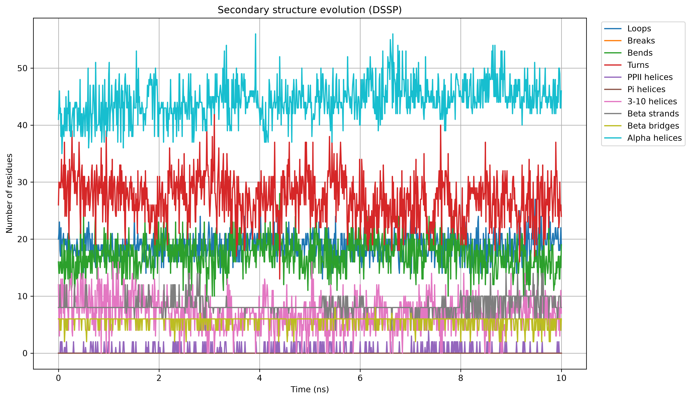
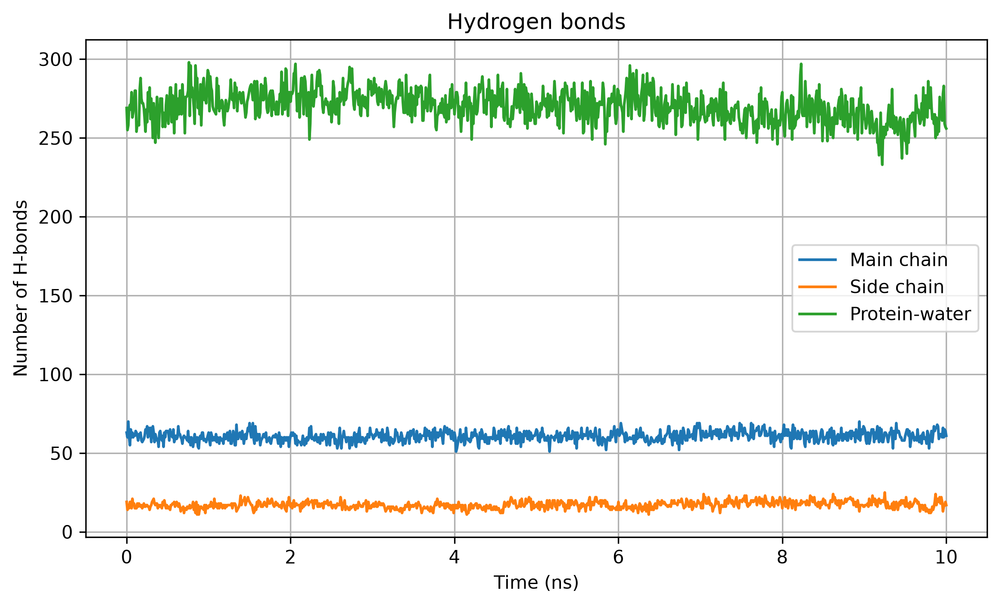

# Lysozyme-in-water

# Молекулярная динамика лизоцима в GROMACS

В данном проекте была проведена молекулярно-динамическая симуляция лизоцима в водном окружении с помощью GROMACS с последующим анализом полученной траектории.

## Последовательность выполнения проекта

1. подготовка структуры белка;
2. построение топологии;
3. добавление воды;
4. добавление ионов;
5. минимизация энергии;
6. NVT-эквилибрация;
7. NPT-эквилибрация;
8. production MD;
9. обработка траектории;
10. анализ RMSD, радиуса инерции, вторичной структуры и водородных связей.

## Production simulation

Основная симуляция проводилась в течение 10 ns.

Параметры:

- длительность: 10 ns;
- шаг интегрирования: 2 fs;
- число шагов: 5 000 000;
- координаты сохранялись каждые 10 ps;
- всего в траектории получилось 1001 сохраненное состояние системы.

Расчет запускался в GROMACS с использованием GPU.

## Обработка траектории

Перед анализом из траектории были убраны артефакты периодических граничных условий, после чего белок был отцентрирован.

Основная проблема исходной траектории связана с периодическими граничными условиями: молекулы могут визуально переходить через границы расчетной ячейки, из-за чего анализ RMSD и других структурных характеристик может быть некорректным.

Для удаления таких артефактов и центрирования белка использовалась команда `gmx trjconv`:

```bash
gmx trjconv -s md.tpr -f md.xtc -o md_noPBC.xtc -pbc mol -center
```

Для центрирования выбиралась группа `Protein`, а в выходную траекторию сохранялась вся система.

В исходной production-траектории было 1001 сохраненное состояние системы с интервалом 10 ps. Общая длительность симуляции составляла 10 ns.

## Использование GPU

Изначально установленная версия GROMACS не имела поддержки GPU, а production simulation на CPU выполнялась крайне медленно и полный ее расчет занял бы 7 суток.

Для ускорения расчета GROMACS 2025.2 был собран из исходников с поддержкой CUDA. Симуляция запускалась в Google Colab на GPU NVIDIA Tesla T4.

Для production MD использовалась команда:

```bash
gmx mdrun -deffnm md -ntmpi 1 -nb gpu -pme gpu
```

После перехода на GPU производительность выросла примерно с 1.36 ns/day на CPU до 136.5 ns/day на Tesla T4.

## RMSD

Для оценки изменения структуры белка во времени был рассчитан RMSD по backbone-атомам.

Использовались два варианта сравнения:

- относительно структуры в начале production MD;
- относительно структуры после energy minimization.

RMSD относительно начала production MD:

```bash
gmx rms -s md.tpr -f md_noPBC.xtc -o rmsd.xvg -tu ns
```

RMSD относительно energy-minimized структуры:

```bash
gmx rms -s em.tpr -f md_noPBC.xtc -o rmsd_xtal.xvg -tu ns
```

В обоих случаях для выравнивания и расчета RMSD использовалась группа `Backbone`.



## Radius of gyration

Для оценки компактности белка во время симуляции был рассчитан radius of gyration.

```bash
gmx gyrate -s md.tpr -f md_noPBC.xtc -o gyrate.xvg -sel Protein -tu ns
```

Этот параметр показывает, насколько меняется общий размер и компактность белковой структуры во времени.



## Вторичная структура

Изменение вторичной структуры белка анализировалось с помощью DSSP.

```bash
gmx dssp -s md.tpr -f md_noPBC.xtc -tu ns -o dssp.dat -num dssp_num.xvg
```

В анализе отслеживались следующие типы вторичной структуры:

- Loops
- Breaks
- Bends
- Turns
- PPII helices
- Pi helices
- 3-10 helices
- Beta strands
- Beta bridges
- Alpha helices

Полученные данные показывают, как количество аминокислотных остатков в различных типах вторичной структуры менялось в течение 10 ns симуляции.



## Водородные связи

Также был проведен анализ водородных связей.

Отдельно рассматривались:

- водородные связи main chain;
- водородные связи side chain;
- водородные связи между белком и водой.

Для расчета использовался `gmx hbond`.

Пример команды:

```bash
gmx hbond -s md.tpr -f md_noPBC.xtc -tu ns -num hbnum_prot_wat.xvg
```

Аналогичные расчеты были проведены для main chain и side chain.



## Анализ результатов

Все полученные `.xvg` файлы обрабатывались в Python.

Для чтения данных использовался NumPy, а для построения графиков — Matplotlib.

Численные результаты анализа находятся в папке `analysis`, а готовые графики — в папке `figures`.

Полные файлы траектории `md.xtc` и `md_noPBC.xtc` в репозиторий не добавлялись из-за их размера.

